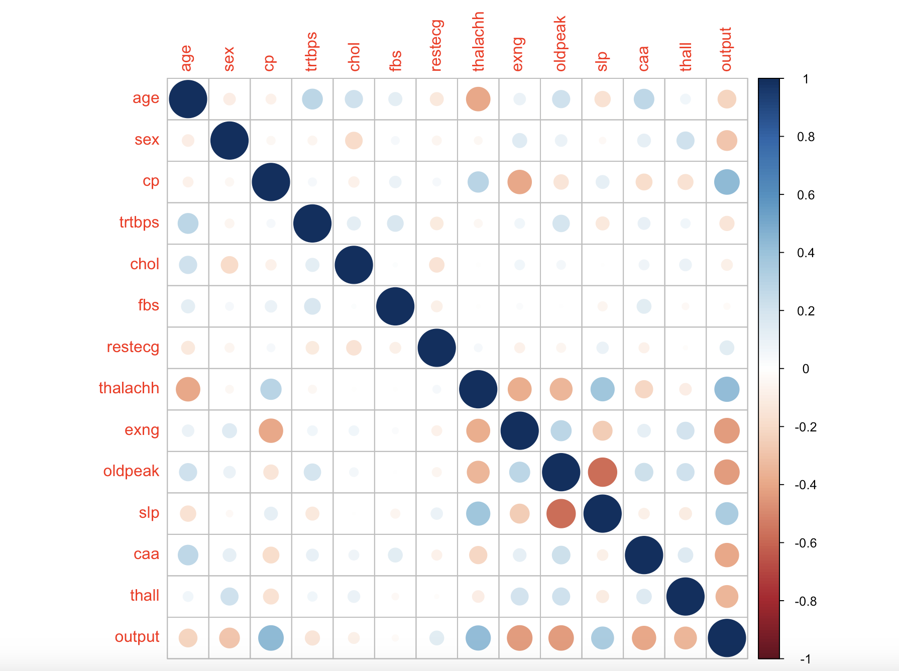
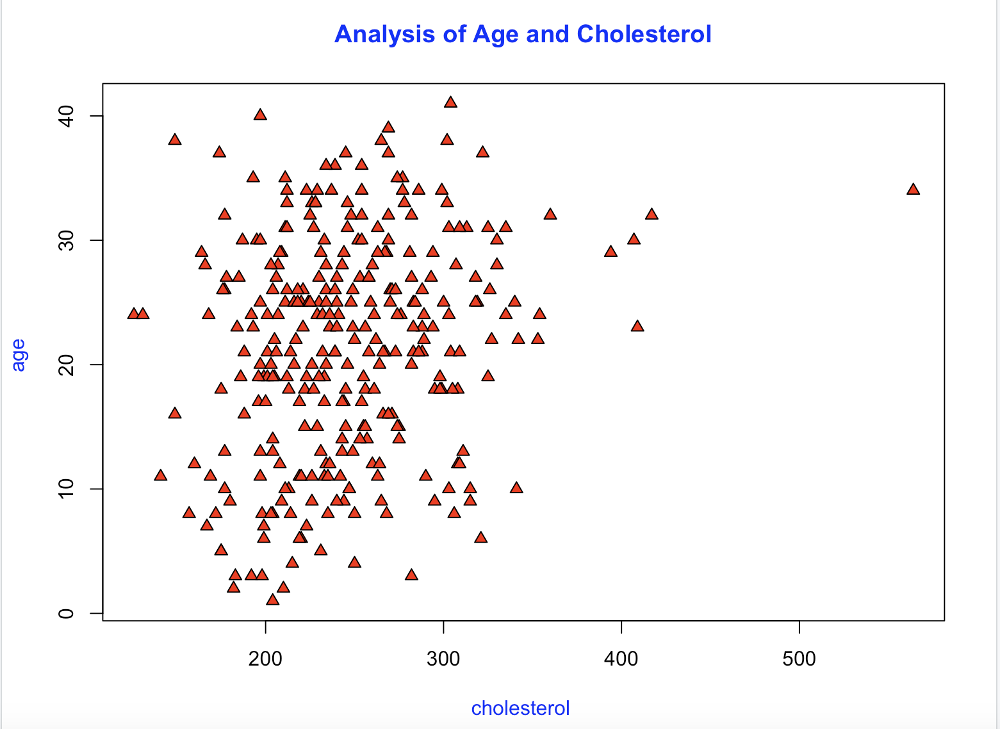
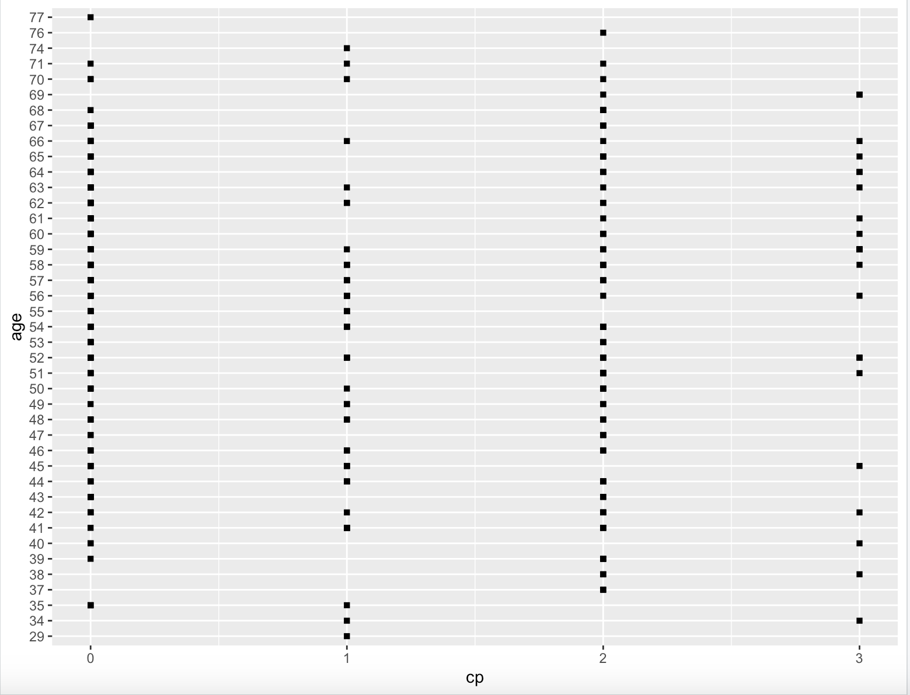
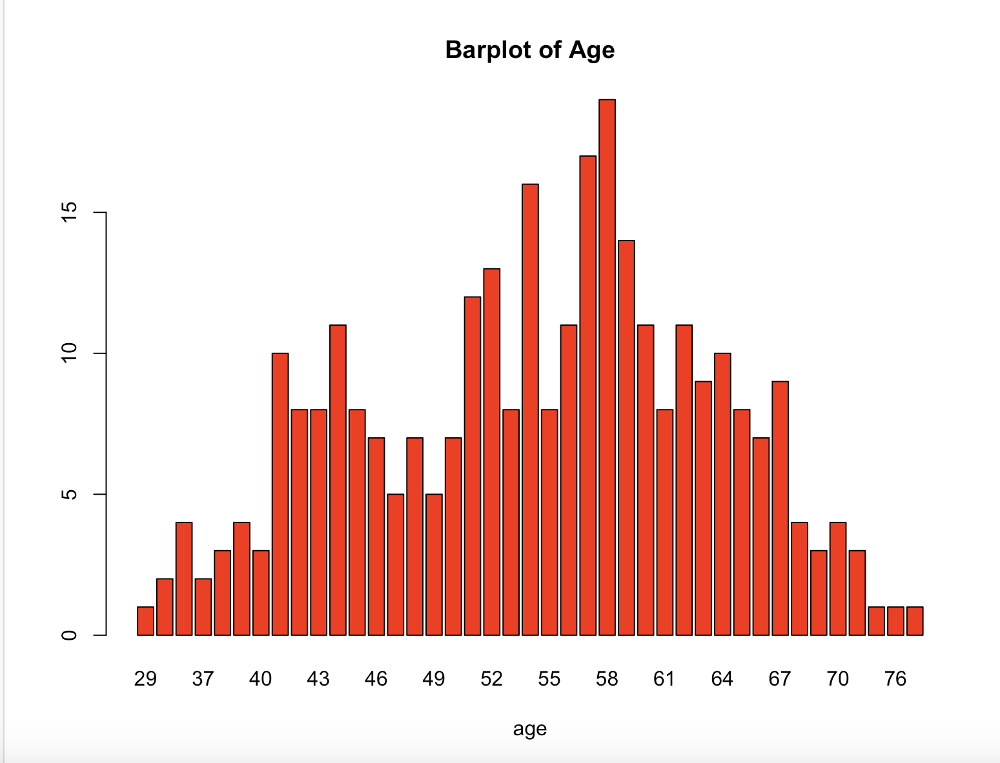
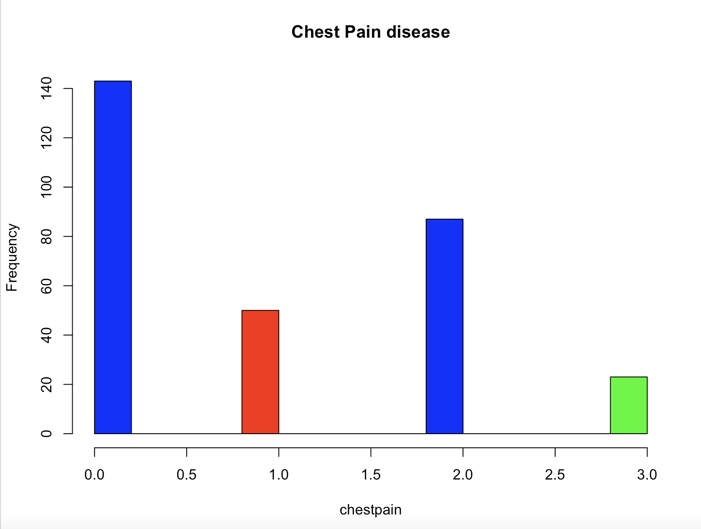
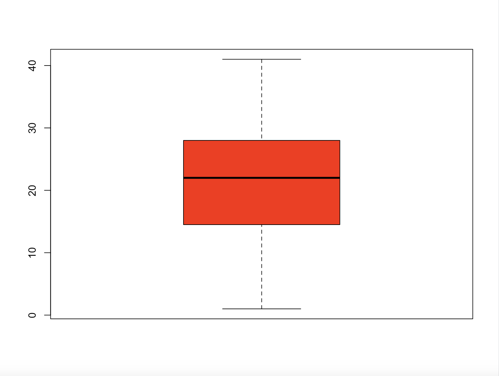

# Heart-Attack-Analysis
The Heart attack analysis predict the chances of heart attack in human by considering some of paramerts such as a
Age, Sex, Blood pressure, cerebral palsy, trestbps,Fasting glucose, etc 

## Getting Started

R language: Version (4.2.2)
Rstudio: Version(4.2.0)

### Prerequisites library

(stats), 
(dplyr), 
(ggplot2), 
(ggfortify), 
(readr), 
(corrplot), 

### Output

## Corrplot

## Plot

## GGPLOT

## Barplot

## Histogram

## BoXplot

